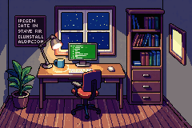

# claude-code-office

GBA-style pixel art office that reflects live Claude Code session state. Built with Pixel Lab AI sprites + Canvas 2D.



## What it does

- Renders a pixel art developer office in GBA (Game Boy Advance) aesthetic
- Character switches between **idle** / **thinking** / **coding** states based on live OpenClaw session data
- Polling the OpenClaw gateway every 5s — no refresh needed
- Auto-cycles states in demo mode when not connected
- Code particles fly off the monitor when coding
- Monitor glow changes color by state (cyan=idle, gold=thinking, green=coding)

## Sprites (generated with Pixel Lab AI)

| Sprite | Description |
|--------|-------------|
| `office-bg.png` | Top-down isometric office room (240×160, GBA native res) |
| `char-idle.png` | Developer character — relaxed sitting pose (32×32) |
| `char-thinking.png` | Developer character — hand on chin, thought bubble (32×32) |
| `char-coding.png` | Developer character — leaning forward, typing (32×32) |
| `terminal.png` | Computer monitor screen with green code (48×32) |

All sprites generated via [Pixel Lab API](https://pixellab.ai) using `generate-image-bitforge` (characters) and `generate-image-pixflux` (scenes).

## Run locally

```bash
# Serve the public/ folder
npx serve public/
# or
python3 -m http.server 3000 --directory public/
# then open http://localhost:3000
```

## Connect to OpenClaw

1. Open the app
2. Enter your OpenClaw gateway URL (default: `http://127.0.0.1:18789`)
3. Enter your gateway token if auth is enabled
4. Click **Connect**

The office will reflect live session state automatically.

## State mapping

| Session signal | Office state |
|---|---|
| No sessions / disconnected | IDLE — character sits relaxed, cyan monitor glow |
| Last message from assistant / "thinking" in content | THINKING — thought bubble appears, gold monitor glow |
| Tool call in progress / "building/pushing/running" in content | CODING — character leans forward, code particles fly, green glow |

## Tech

- Vanilla JS + Canvas 2D — no dependencies
- GBA resolution: 240×160 (scaled up in CSS)
- Scanline + glare overlays for CRT effect
- `image-rendering: pixelated` for crisp sprites
- Pixel Lab API for sprite generation (`generate-sprite.py`)

## Regenerate sprites

```bash
export PIXELLAB_TOKEN="your-token-here"
python3 scripts/generate-sprites.py
```
